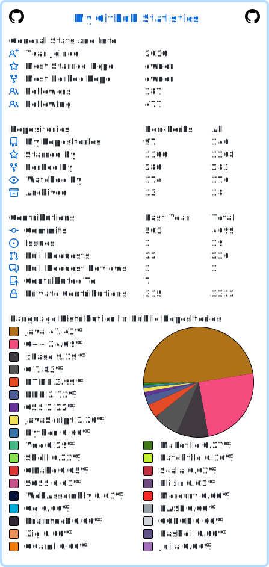

# Matteo Baccan

Hi, I'm Matteo Baccan. I'm a software engineer from Italy.

<!--
  
  
-->

[👦 Check out my website](https://www.baccan.it)

[📈 My Metrics](https://metrics.lecoq.io/about/matteobaccan)

[🏆 My Resume](https://resume.github.io/?matteobaccan)

[🙋🏻 Ask a question](https://github.com/matteobaccan/matteobaccan/issues/new) You can ask anything but I might choose not to reply 😛

## My courses

Below is the material I have produced over time while studying various technologies. It can be used as a support for course creation or as personal study material.

| Corso | Descrizione |
|-------|-------------|
| [Path To Senior Developer](https://github.com/matteobaccan/PathToSeniorDeveloper) | Il mio libro di riflessioni che ogni sviluppatore dovrebbe porsi per passare da Junior a Senior |
| [WebDesign](https://github.com/matteobaccan/CorsoWebDesign) | Materiale in italiano propedeutico alla realizzazione di corsi di WebDesign |
| [WebDesign2](https://github.com/matteobaccan/CorsoWebDesign2) | Materiale in italiano propedeutico alla realizzazione di corsi avanzati di WebDesign |
| [HTML](https://github.com/matteobaccan/CorsoHTML) | Materiale in italiano propedeutico alla realizzazione di corsi HTML5 - Slide ed esempi    |
| [HTMX](https://github.com/matteobaccan/CorsoHTMX) | Materiale in italiano propedeutico alla realizzazione di corsi HTMX - Slide ed esempi |
| [CSS](https://github.com/matteobaccan/CorsoCSS) | Materiale in italiano propedeutico alla realizzazione di corsi CSS3 - Slide ed esempi    |
| [SASS](https://github.com/matteobaccan/CorsoSASS) | Materiale in italiano propedeutico alla realizzazione di corsi SASS - Slide ed esempi | 
| [Introduzione a Javascript](https://github.com/matteobaccan/CorsoJavascript) | Materiale in italiano propedeutico alla realizzazione di corsi Javascript - Slide ed esempi    |
| [jQuery](https://github.com/matteobaccan/CorsojQuery) | Materiale in italiano propedeutico alla realizzazione di corsi jQuery - Slide e esempi    |

## Some of my projects

|      Project :octocat:   |     Issues :bug:   | Open PRs :bell:  | Closed PRs :fire:  |
|-------------|-------------------|---|---|
| [**Owner**](https://github.com/matteobaccan/owner) |  |   |   |
| [**HarbourJWT**](https://github.com/matteobaccan/HarbourJwt) |  |   |   |
| [**SockRedirector**](https://github.com/matteobaccan/SockRedirector) |  |   |   |
| [**Cheshire Cat API Client Java**](https://github.com/matteobaccan/cheshire-cat-api-client-java) |  |   |   |

## My slides

Below is the material I have produced over time while studying various technologies, too short for use it for a course

| Corso | Descrizione |
|-------|-------------|
| [Programming Languages Of Tomorrow](https://github.com/matteobaccan/ProgrammingLanguagesOfTomorrow)| 2024 and Beyond: The Programming Languages of Tomorrow |
| [Introduzione alla UX](https://github.com/matteobaccan/CorsoUX) | Materiale in italiano propedeutico alla realizzazione di corsi UX Design - Slide, domande di autovalutazione |
| [Introduzione alla AI](https://github.com/matteobaccan/CorsoAI) | Materiale in italiano propedeutico alla realizzazione di corsi sull'intelligenza artificiale - Slide || 
| [Guida Pratica all'uso delle AI](https://github.com/matteobaccan/CorsoAIBook) | Libro in italiano per capire come usare le intelligenze artificiali nella vita di tutti i giorni || 
| [Concetti di base della Reputation Economy](https://github.com/matteobaccan/CorsoReputationEconomy) | Concetti di base della Reputation Economy: cos'è e perché dovremmo tenerne conto - Slide |
| [Concetti Reputazione Digitale](https://github.com/matteobaccan/CorsoReputazioneDigitale) | Concetti di base della Reputation digitale: quanto conta la nostra reputazione? - Slide |
| [Come fare un rimprovero](https://github.com/matteobaccan/CorsoRimprovero) | Come fare un rimprovero? Impariamo da Josè Mourinho - Slide |
| [Online IDE](https://github.com/matteobaccan/CorsoOnlineIDE) | Alternative a CodeSpace per l'edit di progetti su GitHub - Slide |
| [AI Generation](https://github.com/matteobaccan/AIGeneration) | Cosa possono fare per noi le attuali AI - Slide |

## My Talks

Inside this project you can find all the events I attended and the material I presented

[All my talks](https://github.com/matteobaccan/Eventi)

### My contributions

### Daily.DEV contribution

All my articles for Codemotion Magazine, translated into English for Daily.DEV

<!-- daily.dev BOOKMARKS:START -->
- [How to tell if you’ve got what it takes: let’s do a code review](https://app.daily.dev/posts/Omobd3BgD?utm_source=rss&utm_medium=bookmarks&utm_campaign=NhnqMXKwwlQ3hCqxXOiQG)
- [Losing a dev means losing a treasure](https://app.daily.dev/posts/oSrjP1UiT?utm_source=rss&utm_medium=bookmarks&utm_campaign=NhnqMXKwwlQ3hCqxXOiQG)
- [From Junior to Senior Developer with ChatGPT](https://app.daily.dev/posts/sq71v8sFx?utm_source=rss&utm_medium=bookmarks&utm_campaign=NhnqMXKwwlQ3hCqxXOiQG)
- [A Higher Salary Alone Is Not Enough to Motivate Change](https://app.daily.dev/posts/yxpA1fucn?utm_source=rss&utm_medium=bookmarks&utm_campaign=NhnqMXKwwlQ3hCqxXOiQG)
- [Programmers as the New Mercenaries: The Evolution of Work in the IT Sector](https://app.daily.dev/posts/WB32OgVHo?utm_source=rss&utm_medium=bookmarks&utm_campaign=NhnqMXKwwlQ3hCqxXOiQG)
- [Adopting New Frameworks Could Jeopardize Your Project](https://app.daily.dev/posts/HdrTAJBNH?utm_source=rss&utm_medium=bookmarks&utm_campaign=NhnqMXKwwlQ3hCqxXOiQG)
- [The “Hardcore” Attitude of Programmers](https://app.daily.dev/posts/2CrohgmXQ?utm_source=rss&utm_medium=bookmarks&utm_campaign=NhnqMXKwwlQ3hCqxXOiQG)
- [How to Know You’ve Become a Senior Programmer](https://app.daily.dev/posts/Z1LXHZySj?utm_source=rss&utm_medium=bookmarks&utm_campaign=NhnqMXKwwlQ3hCqxXOiQG)
- [The Myth of the Full Stack Developer: an Uncomfortable Reality](https://app.daily.dev/posts/Ko9aavfST?utm_source=rss&utm_medium=bookmarks&utm_campaign=NhnqMXKwwlQ3hCqxXOiQG)
- [Programmers who complete all tasks have not finished their workday](https://app.daily.dev/posts/fMMUy7g3T?utm_source=rss&utm_medium=bookmarks&utm_campaign=NhnqMXKwwlQ3hCqxXOiQG)
- [Can You Become a Programmer After 40?](https://app.daily.dev/posts/owOpgTHU6?utm_source=rss&utm_medium=bookmarks&utm_campaign=NhnqMXKwwlQ3hCqxXOiQG)
<!-- daily.dev BOOKMARKS:END -->

### Hacktoberfest 2023-2024 badges

<!-- 
### More statistics

-->

<!--

-->

<!--https://simpleicons.org/?q=raspb -->
<!-- https://shields.io/ -->

### 💻 Languages I have used

### 🗜 Some of the technologies I have worked with

<!--

-->

<!--

-->

<!--

-->

<!--

-->

<!--

-->

