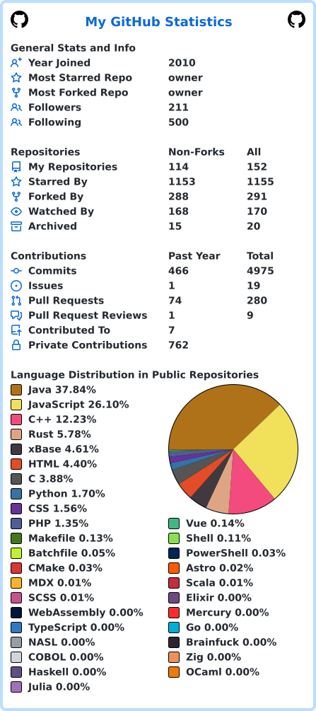

# Matteo Baccan

Hi, I'm Matteo Baccan. I'm a software engineer from Italy.

<!--
  
  
-->

[👦 Check out my website](https://www.baccan.it)

<!--
[📈 My Metrics](https://metrics.lecoq.io/about/matteobaccan)
-->

[🏆 My GitHub Resume](https://resume.github.io/?matteobaccan)

[🙋🏻 Ask a question](https://github.com/matteobaccan/matteobaccan/issues/new) You can ask anything but I might choose not to reply 😛

## My open source contributions

Projects with more than 1000 stars where I have contributed with at least one merged pull request

| Project | My merged PRs :handshake: | Stars :star: |
|---|---|---|
| [**locationtech/jts**](https://github.com/locationtech/jts) | [8](https://github.com/locationtech/jts/pulls?q=is%3Apr+author%3Amatteobaccan+is%3Amerged) |  |
| [**OpenAPITools/openapi-generator**](https://github.com/OpenAPITools/openapi-generator) | [2](https://github.com/OpenAPITools/openapi-generator/pulls?q=is%3Apr+author%3Amatteobaccan+is%3Amerged) |  |
| [**kaikramer/keystore-explorer**](https://github.com/kaikramer/keystore-explorer) | [2](https://github.com/kaikramer/keystore-explorer/pulls?q=is%3Apr+author%3Amatteobaccan+is%3Amerged) |  |
| [**kishanrajput23/Java-Projects-Collections**](https://github.com/kishanrajput23/Java-Projects-Collections) | [2](https://github.com/kishanrajput23/Java-Projects-Collections/pulls?q=is%3Apr+author%3Amatteobaccan+is%3Amerged) |  |
| [**githubnext/copilot-workspace-user-manual**](https://github.com/githubnext/copilot-workspace-user-manual) | [2](https://github.com/githubnext/copilot-workspace-user-manual/pulls?q=is%3Apr+author%3Amatteobaccan+is%3Amerged) |  |
| [**ArcadeData/arcadedb**](https://github.com/ArcadeData/arcadedb) | [2](https://github.com/ArcadeData/arcadedb/pulls?q=is%3Apr+author%3Amatteobaccan+is%3Amerged) |  |
| [**apache/artemis**](https://github.com/apache/artemis) | [2](https://github.com/apache/artemis/pulls?q=is%3Apr+author%3Amatteobaccan+is%3Amerged) |  |
| [**EbookFoundation/free-programming-books**](https://github.com/EbookFoundation/free-programming-books) | [1](https://github.com/EbookFoundation/free-programming-books/pulls?q=is%3Apr+author%3Amatteobaccan+is%3Amerged) |  |
| [**sveltejs/svelte**](https://github.com/sveltejs/svelte) | [1](https://github.com/sveltejs/svelte/pulls?q=is%3Apr+author%3Amatteobaccan+is%3Amerged) |  |
| [**redis/redis**](https://github.com/redis/redis) | [1](https://github.com/redis/redis/pulls?q=is%3Apr+author%3Amatteobaccan+is%3Amerged) |  |
| [**barry-ran/QtScrcpy**](https://github.com/barry-ran/QtScrcpy) | [1](https://github.com/barry-ran/QtScrcpy/pulls?q=is%3Apr+author%3Amatteobaccan+is%3Amerged) |  |
| [**alibaba/fastjson**](https://github.com/alibaba/fastjson) | [1](https://github.com/alibaba/fastjson/pulls?q=is%3Apr+author%3Amatteobaccan+is%3Amerged) |  |
| [**iBotPeaches/Apktool**](https://github.com/iBotPeaches/Apktool) | [1](https://github.com/iBotPeaches/Apktool/pulls?q=is%3Apr+author%3Amatteobaccan+is%3Amerged) |  |
| [**antirez/ds4**](https://github.com/antirez/ds4) | [1](https://github.com/antirez/ds4/pulls?q=is%3Apr+author%3Amatteobaccan+is%3Amerged) |  |
| [**zaproxy/zaproxy**](https://github.com/zaproxy/zaproxy) | [1](https://github.com/zaproxy/zaproxy/pulls?q=is%3Apr+author%3Amatteobaccan+is%3Amerged) |  |
| [**projectlombok/lombok**](https://github.com/projectlombok/lombok) | [1](https://github.com/projectlombok/lombok/pulls?q=is%3Apr+author%3Amatteobaccan+is%3Amerged) |  |
| [**google/sentencepiece**](https://github.com/google/sentencepiece) | [1](https://github.com/google/sentencepiece/pulls?q=is%3Apr+author%3Amatteobaccan+is%3Amerged) |  |
| [**veracrypt/VeraCrypt**](https://github.com/veracrypt/VeraCrypt) | [1](https://github.com/veracrypt/VeraCrypt/pulls?q=is%3Apr+author%3Amatteobaccan+is%3Amerged) |  |
| [**oracle/opengrok**](https://github.com/oracle/opengrok) | [1](https://github.com/oracle/opengrok/pulls?q=is%3Apr+author%3Amatteobaccan+is%3Amerged) |  |
| [**fabric8io/kubernetes-client**](https://github.com/fabric8io/kubernetes-client) | [1](https://github.com/fabric8io/kubernetes-client/pulls?q=is%3Apr+author%3Amatteobaccan+is%3Amerged) |  |
| [**apache/netbeans**](https://github.com/apache/netbeans) | [1](https://github.com/apache/netbeans/pulls?q=is%3Apr+author%3Amatteobaccan+is%3Amerged) |  |
| [**FarGroup/FarManager**](https://github.com/FarGroup/FarManager) | [1](https://github.com/FarGroup/FarManager/pulls?q=is%3Apr+author%3Amatteobaccan+is%3Amerged) |  |
| [**geotools/geotools**](https://github.com/geotools/geotools) | [1](https://github.com/geotools/geotools/pulls?q=is%3Apr+author%3Amatteobaccan+is%3Amerged) |  |
| [**git-commit-id/git-commit-id-maven-plugin**](https://github.com/git-commit-id/git-commit-id-maven-plugin) | [1](https://github.com/git-commit-id/git-commit-id-maven-plugin/pulls?q=is%3Apr+author%3Amatteobaccan+is%3Amerged) |  |
| [**kairichard/awesome-nocode-lowcode**](https://github.com/kairichard/awesome-nocode-lowcode) | [1](https://github.com/kairichard/awesome-nocode-lowcode/pulls?q=is%3Apr+author%3Amatteobaccan+is%3Amerged) |  |
| [**microsoft/mssql-jdbc**](https://github.com/microsoft/mssql-jdbc) | [1](https://github.com/microsoft/mssql-jdbc/pulls?q=is%3Apr+author%3Amatteobaccan+is%3Amerged) |  |

## Some of my projects

All my repositories with at least 5 stars

| Project :octocat: | Stars :star: | Issues :bug: | Open PRs :bell: | Closed PRs :fire: |
|---|---|---|---|---|
| [**Owner**](https://github.com/matteobaccan/owner) |  |  |  |  |
| [**MultiRipper**](https://github.com/matteobaccan/MultiRipper) |  |  |  |  |
| [**HTML2POP3**](https://github.com/matteobaccan/html2pop3) |  |  |  |  |
| [**SockRedirector**](https://github.com/matteobaccan/SockRedirector) |  |  |  |  |
| [**HarbourJWT**](https://github.com/matteobaccan/HarbourJwt) |  |  |  |  |
| [**Guida Pratica all'uso delle AI**](https://github.com/matteobaccan/CorsoAIBook) |  |  |  |  |
| [**Corso AI**](https://github.com/matteobaccan/CorsoAI) |  |  |  |  |
| [**PassiveCooker**](https://github.com/matteobaccan/PassiveCooker) |  |  |  |  |
| [**Corso HTML**](https://github.com/matteobaccan/CorsoHTML) |  |  |  |  |
| [**Cheshire Cat API Client Java**](https://github.com/matteobaccan/cheshire-cat-api-client-java) |  |  |  |  |

## Skills

### 💻 Languages I have used

### 🧪 Languages I have explored

Languages I have tried out in my [boilerplate collection](https://github.com/matteobaccan?tab=repositories&q=boilerplate&type=source), a set of minimal starting projects

### 🗜 Some of the technologies I have worked with

## My books

| Title | Description |
|-------|-------------|
| [Path To Senior Developer](https://github.com/matteobaccan/PathToSeniorDeveloper) | Il mio libro di riflessioni che ogni sviluppatore dovrebbe porsi per passare da Junior a Senior |
| [Guida Pratica all'uso delle AI](https://github.com/matteobaccan/CorsoAIBook) | Libro in italiano per capire come usare le intelligenze artificiali nella vita di tutti i giorni |

## My courses

Below is the material I have produced over time while studying various technologies. It can be used as a support for course creation or as personal study material.

| Corso | Descrizione |
|-------|-------------|
| [WebDesign](https://github.com/matteobaccan/CorsoWebDesign) | Materiale in italiano del mio corso di WebDesign |
| [WebDesign2](https://github.com/matteobaccan/CorsoWebDesign2) | Materiale in italiano del mio corso avanzato di WebDesign |
| [HTML](https://github.com/matteobaccan/CorsoHTML) | Materiale in italiano del mio corso HTML5 - Slide ed esempi    |
| [CSS](https://github.com/matteobaccan/CorsoCSS) | Materiale in italiano del mio corso CSS3 - Slide ed esempi    |
| [WCAG](https://github.com/matteobaccan/CorsoWCAG) | Materiale in italiano del mio corso WCAG - Slide ed esempi |
| [Introduzione alla AI](https://github.com/matteobaccan/CorsoAI) | Materiale in italiano del mio corso sull'intelligenza artificiale - Slide |
| [Introduzione alla UX](https://github.com/matteobaccan/CorsoUX) | Materiale in italiano del mio corso di UX Design - Slide, domande di autovalutazione |
| [SASS](https://github.com/matteobaccan/CorsoSASS) | Materiale in italiano propedeutico alla realizzazione di corsi SASS - Slide ed esempi |
| [Introduzione a Javascript](https://github.com/matteobaccan/CorsoJavascript) | Materiale in italiano propedeutico alla realizzazione di corsi Javascript - Slide ed esempi    |
| [jQuery](https://github.com/matteobaccan/CorsojQuery) | Materiale in italiano propedeutico alla realizzazione di corsi jQuery - Slide ed esempi    |
| [HTMX](https://github.com/matteobaccan/CorsoHTMX) | **in preparazione** Materiale in italiano propedeutico del mio corso HTMX - Slide ed esempi |

## My slides

Below is the material I have produced over time while studying various technologies, too short to be used for a course

| Corso | Descrizione |
|-------|-------------|
| [Programming Languages Of Tomorrow](https://github.com/matteobaccan/ProgrammingLanguagesOfTomorrow)| 2024 and Beyond: The Programming Languages of Tomorrow |
| [Concetti di base della Reputation Economy](https://github.com/matteobaccan/CorsoReputationEconomy) | Concetti di base della Reputation Economy: cos'è e perché dovremmo tenerne conto - Slide |
| [Concetti Reputazione Digitale](https://github.com/matteobaccan/CorsoReputazioneDigitale) | Concetti di base della Reputation digitale: quanto conta la nostra reputazione? - Slide |
| [Come fare un rimprovero](https://github.com/matteobaccan/CorsoRimprovero) | Come fare un rimprovero? Impariamo da José Mourinho - Slide |
| [Online IDE](https://github.com/matteobaccan/CorsoOnlineIDE) | Alternative a Codespaces per l'edit di progetti su GitHub - Slide |
| [AI Generation](https://github.com/matteobaccan/AIGeneration) | Cosa possono fare per noi le attuali AI - Slide |

## My Talks

Inside this project you can find all the events I attended and the material I presented

[All my talks](https://github.com/matteobaccan/Eventi)

## My articles

### Daily.DEV contribution

All my articles for Codemotion Magazine, translated into English for Daily.DEV

Read the latest articles

<!-- daily.dev BOOKMARKS:START -->
- [HTTP QUERY: the method that was missing between GET and POST](https://daily.dev/posts/mWDApVZ8T?utm_source=rss&utm_medium=bookmarks&utm_campaign=NhnqMXKwwlQ3hCqxXOiQG)
- [De Crescenzo’s choice](https://daily.dev/posts/oQmN1ZmnL?utm_source=rss&utm_medium=bookmarks&utm_campaign=NhnqMXKwwlQ3hCqxXOiQG)
- [Is the human the bug or the feature of AI development?](https://daily.dev/posts/0xSCSqnwS?utm_source=rss&utm_medium=bookmarks&utm_campaign=NhnqMXKwwlQ3hCqxXOiQG)
- [AI Predicts Music Contest Winner: Reality Disagrees](https://daily.dev/posts/8Z8lJgKfQ?utm_source=rss&utm_medium=bookmarks&utm_campaign=NhnqMXKwwlQ3hCqxXOiQG)
- [The Engineering of the Possible: Beyond the “Best Practices” Dogma](https://daily.dev/posts/JbLJZq9XC?utm_source=rss&utm_medium=bookmarks&utm_campaign=NhnqMXKwwlQ3hCqxXOiQG)
- [What if we were all becoming Borg? When AI becomes assimilation in software development](https://daily.dev/posts/pSm58vU9r?utm_source=rss&utm_medium=bookmarks&utm_campaign=NhnqMXKwwlQ3hCqxXOiQG)
- [The Illusion of Speed in the AI Era](https://daily.dev/posts/8rRH5mF9H?utm_source=rss&utm_medium=bookmarks&utm_campaign=NhnqMXKwwlQ3hCqxXOiQG)
- [A Great Programmer Removes, Doesn’t Add](https://daily.dev/posts/JwX9KlioE?utm_source=rss&utm_medium=bookmarks&utm_campaign=NhnqMXKwwlQ3hCqxXOiQG)
- [Fundraising has become the end for startups, not the means to grow](https://daily.dev/posts/d7kQkRYzm?utm_source=rss&utm_medium=bookmarks&utm_campaign=NhnqMXKwwlQ3hCqxXOiQG)
- [The world of programming has changed and with it the way to become a programmer](https://daily.dev/posts/OV4nquIOS?utm_source=rss&utm_medium=bookmarks&utm_campaign=NhnqMXKwwlQ3hCqxXOiQG)
- [Why Tech Startups Are Doomed to Die](https://daily.dev/posts/5Uqct5X2T?utm_source=rss&utm_medium=bookmarks&utm_campaign=NhnqMXKwwlQ3hCqxXOiQG)
- [What if the weak link in programming is the programmer themself?](https://daily.dev/posts/8wJLMyzED?utm_source=rss&utm_medium=bookmarks&utm_campaign=NhnqMXKwwlQ3hCqxXOiQG)
- [The strength of admitting you don’t know](https://daily.dev/posts/wDT21YdKh?utm_source=rss&utm_medium=bookmarks&utm_campaign=NhnqMXKwwlQ3hCqxXOiQG)
- [How to tell if you’ve got what it takes: let’s do a code review](https://daily.dev/posts/Omobd3BgD?utm_source=rss&utm_medium=bookmarks&utm_campaign=NhnqMXKwwlQ3hCqxXOiQG)
- [Losing a dev means losing a treasure](https://daily.dev/posts/oSrjP1UiT?utm_source=rss&utm_medium=bookmarks&utm_campaign=NhnqMXKwwlQ3hCqxXOiQG)
- [From Junior to Senior Developer with ChatGPT](https://daily.dev/posts/sq71v8sFx?utm_source=rss&utm_medium=bookmarks&utm_campaign=NhnqMXKwwlQ3hCqxXOiQG)
- [A Higher Salary Alone Is Not Enough to Motivate Change](https://daily.dev/posts/yxpA1fucn?utm_source=rss&utm_medium=bookmarks&utm_campaign=NhnqMXKwwlQ3hCqxXOiQG)
- [Programmers as the New Mercenaries: The Evolution of Work in the IT Sector](https://daily.dev/posts/WB32OgVHo?utm_source=rss&utm_medium=bookmarks&utm_campaign=NhnqMXKwwlQ3hCqxXOiQG)
- [Adopting New Frameworks Could Jeopardize Your Project](https://daily.dev/posts/HdrTAJBNH?utm_source=rss&utm_medium=bookmarks&utm_campaign=NhnqMXKwwlQ3hCqxXOiQG)
- [The “Hardcore” Attitude of Programmers](https://daily.dev/posts/2CrohgmXQ?utm_source=rss&utm_medium=bookmarks&utm_campaign=NhnqMXKwwlQ3hCqxXOiQG)
<!-- daily.dev BOOKMARKS:END -->

## Stats and badges

### My contributions

### Trophy

### Hacktoberfest 2023-2025 badges

<!--
### More statistics

-->

<!--

-->

<!--https://simpleicons.org/?q=raspb -->
<!-- https://shields.io/ -->

<!--

-->

<!--

-->

<!--

-->

<!--

-->

<!--

-->
