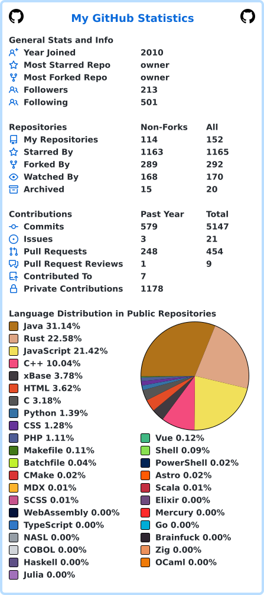

# Matteo Baccan

I'm a software engineer from Italy. I write code, books and articles, and I have been speaking at programming conferences since 2000.

These days I mostly work on AI-assisted development: Spec-Driven Development, agent skills for Claude Code and the way AI is changing the job of the programmer.

[👦 Check out my website](https://www.baccan.it) · [🏆 My GitHub Resume](https://resume.github.io/?matteobaccan) · [🙋🏻 Ask a question](https://github.com/matteobaccan/matteobaccan/issues/new) (you can ask anything, but I might choose not to reply 😛)

### 🔭 Currently

- ✍️ Writing [CleanSpec](https://github.com/matteobaccan/CleanSpec), a book on Spec-Driven Development
- 🎤 Talking about how [Spec-Driven Development is changing the way we program](https://github.com/matteobaccan/wemakefuture2026)
- 🤖 Building [agent skills](#my-ai-skills) for Claude Code, the latest is [ScamCheck](https://github.com/matteobaccan/ScamCheck)
- 📰 Writing for [Codemotion Magazine](#my-articles)

## My AI Skills

Agent skills I have created, ready to be used with Claude and other AI agents

### 💼 Professional skills

Skills for real work: security, web optimization, recruiting

| Skill | Description |
|---|---|
| [ScamCheck](https://github.com/matteobaccan/ScamCheck) | Skill per Claude Code che valuta se un sito è una probabile truffa (falsi negozi, phishing, finti investimenti o crypto, finti servizi) e produce un verdetto motivato, anche come report PDF in qualsiasi lingua |
| [SiteScan](https://github.com/matteobaccan/SiteScan) | Skill per l'analisi di un sito: riconosce CMS, framework e stack del server, controlla gli header di sicurezza e i percorsi esposti in `robots.txt`, e produce un report dei rischi |
| [AgentReady](https://github.com/matteobaccan/AgentReady) | Skill per valutare quanto un sito è pronto per gli AI agent: 30 controlli, punteggio da 0 a 5 e generazione di `robots.txt`, `llms.txt`, file `.well-known/` e regole server |
| [Static Site Optimizer](https://github.com/matteobaccan/static-site-optimizer) | Skill per l'analisi e l'ottimizzazione di siti statici: performance, SEO, accessibilità e best practice |
| [CV-Review](https://github.com/matteobaccan/cv-review) | Skill per Claude Code che valuta curriculum vitae in modo confrontabile, tracciabile e non discriminatorio |

### 🎭 Fun skills

Skills for satire, comedy and leisure

| Skill | Description |
|---|---|
| [LinkedInCringe](https://github.com/matteobaccan/LinkedInCringe) | Tre skill per il cringe su LinkedIn: `linkedin-cringe` scrive storie cringe, `linkedin-cringe-meter` (il Cringiometro) dà a un post un voto di cringe da 1 a 10 e genera un'immagine da usare come risposta, `linkedin-cringe-analytics` analizza i commenti per capire chi ci ha creduto e chi ha colto lo scherzo |
| [PitchCringe](https://github.com/matteobaccan/PitchCringe) | Skill per Claude Code che genera pitch deck di startup cringe in formato Marp |
| [StandUpComedy](https://github.com/matteobaccan/StandUpComedy) | Skill per la scrittura di monologhi di Stand Up Comedy |
| [Scrittura Comica](https://github.com/matteobaccan/CorsoScritturaComica) | Skill per la scrittura di battute e monologhi comici, basata sulle tecniche del corso di Federico Basso |
| [FantaSkill](https://github.com/matteobaccan/FantaSkill) | Skill per Claude Code che prepara l'asta del fantacalcio partendo da dati reali: genera un Excel da tenere aperto durante l'asta e un dossier con i consigli |

## Some of my projects

My code repositories with at least 5 stars. Books, courses and skills have their own sections.

| Project | Description | Stars |
|---|---|---|
| [**Owner**](https://github.com/matteobaccan/owner) | Java library that removes the boilerplate code of properties based configuration |  |
| [**MultiRipper**](https://github.com/matteobaccan/MultiRipper) | Multi-purpose file ripper written in Harbour |  |
| [**HTML2POP3**](https://github.com/matteobaccan/html2pop3) | Virtual POP3, SMTP and NNTP server |  |
| [**SockRedirector**](https://github.com/matteobaccan/SockRedirector) | Redirects TCP connections from one IP address and port to another |  |
| [**HarbourJWT**](https://github.com/matteobaccan/HarbourJwt) | JWT implementation for Harbour |  |
| [**PassiveCooker**](https://github.com/matteobaccan/PassiveCooker) | Arduino project for the Barilla Passive Cooker |  |
| [**Cheshire Cat API Client Java**](https://github.com/matteobaccan/cheshire-cat-api-client-java) | Java client for the Cheshire Cat AI framework |  |
| [**FastTail**](https://github.com/matteobaccan/FastTail) | Ultra-fast multi-stream log monitor and tail viewer written in Rust |  |

## My books

| Title | Description |
|---|---|
| [CleanSpec](https://github.com/matteobaccan/CleanSpec) | A book on Spec-Driven Development: how to write specifications that AI coding agents can turn into correct software |
| [Path To Senior Developer](https://github.com/matteobaccan/PathToSeniorDeveloper) | Il mio libro di riflessioni che ogni sviluppatore dovrebbe porsi per passare da Junior a Senior |
| [Guida Pratica all'uso delle AI](https://github.com/matteobaccan/CorsoAIBook) | Libro in italiano per capire come usare le intelligenze artificiali nella vita di tutti i giorni |

## My courses

Material I have produced over time while studying various technologies. It can be used as a support for course creation or as personal study material. Most of it is in Italian.

| Course | Description |
|---|---|
| [WebDesign](https://github.com/matteobaccan/CorsoWebDesign) | Materiale in italiano del mio corso di WebDesign |
| [WebDesign2](https://github.com/matteobaccan/CorsoWebDesign2) | Materiale in italiano del mio corso avanzato di WebDesign |
| [HTML](https://github.com/matteobaccan/CorsoHTML) | Materiale in italiano del mio corso HTML5 - Slide ed esempi    |
| [CSS](https://github.com/matteobaccan/CorsoCSS) | Materiale in italiano del mio corso CSS3 - Slide ed esempi    |
| [WCAG](https://github.com/matteobaccan/CorsoWCAG) | Materiale in italiano del mio corso WCAG - Slide ed esempi |
| [Introduzione alla AI](https://github.com/matteobaccan/CorsoAI) | Materiale in italiano del mio corso sull'intelligenza artificiale - Slide |
| [Introduzione alla UX](https://github.com/matteobaccan/CorsoUX) | Materiale in italiano del mio corso di UX Design - Slide, domande di autovalutazione |
| [SASS](https://github.com/matteobaccan/CorsoSASS) | Materiale in italiano propedeutico alla realizzazione di corsi SASS - Slide ed esempi |
| [Introduzione a Javascript](https://github.com/matteobaccan/CorsoJavascript) | Materiale in italiano propedeutico alla realizzazione di corsi Javascript - Slide ed esempi    |
| [jQuery](https://github.com/matteobaccan/CorsojQuery) | Materiale in italiano propedeutico alla realizzazione di corsi jQuery - Slide ed esempi    |
| [HTMX](https://github.com/matteobaccan/CorsoHTMX) | **in preparazione** Materiale in italiano propedeutico del mio corso HTMX - Slide ed esempi |
| [Scrittura Comica](https://github.com/matteobaccan/CorsoScritturaComica) | Appunti in italiano del corso di scrittura comica di Federico Basso - Slide |

## My slides

Material too short to be used for a course

| Slides | Description |
|---|---|
| [Programming Languages Of Tomorrow](https://github.com/matteobaccan/ProgrammingLanguagesOfTomorrow)| 2024 and Beyond: The Programming Languages of Tomorrow |
| [Concetti di base della Reputation Economy](https://github.com/matteobaccan/CorsoReputationEconomy) | Concetti di base della Reputation Economy: cos'è e perché dovremmo tenerne conto - Slide |
| [Concetti Reputazione Digitale](https://github.com/matteobaccan/CorsoReputazioneDigitale) | Concetti di base della Reputation digitale: quanto conta la nostra reputazione? - Slide |
| [Come fare un rimprovero](https://github.com/matteobaccan/CorsoRimprovero) | Come fare un rimprovero? Impariamo da José Mourinho - Slide |
| [Online IDE](https://github.com/matteobaccan/CorsoOnlineIDE) | Alternative a Codespaces per l'edit di progetti su GitHub - Slide |
| [AI Generation](https://github.com/matteobaccan/AIGeneration) | Cosa possono fare per noi le attuali AI - Slide |

## My talks

[All my talks](https://github.com/matteobaccan/Eventi): every event I attended and the material I presented, since 2000

## My articles

### Daily.DEV contribution

All my articles for Codemotion Magazine, translated into English for Daily.DEV

Read the latest articles

<!-- daily.dev BOOKMARKS:START -->
- [The end of the prompt era: why the future of AI development belongs to those who write specs &lpar;SDD&rpar;](https://daily.dev/posts/t9kApfPm2?utm_source=rss&utm_medium=bookmarks&utm_campaign=NhnqMXKwwlQ3hCqxXOiQG)
- [HTTP QUERY: the method that was missing between GET and POST](https://daily.dev/posts/mWDApVZ8T?utm_source=rss&utm_medium=bookmarks&utm_campaign=NhnqMXKwwlQ3hCqxXOiQG)
- [De Crescenzo’s choice](https://daily.dev/posts/oQmN1ZmnL?utm_source=rss&utm_medium=bookmarks&utm_campaign=NhnqMXKwwlQ3hCqxXOiQG)
- [Is the human the bug or the feature of AI development?](https://daily.dev/posts/0xSCSqnwS?utm_source=rss&utm_medium=bookmarks&utm_campaign=NhnqMXKwwlQ3hCqxXOiQG)
- [AI Predicts Music Contest Winner: Reality Disagrees](https://daily.dev/posts/8Z8lJgKfQ?utm_source=rss&utm_medium=bookmarks&utm_campaign=NhnqMXKwwlQ3hCqxXOiQG)
- [The Engineering of the Possible: Beyond the “Best Practices” Dogma](https://daily.dev/posts/JbLJZq9XC?utm_source=rss&utm_medium=bookmarks&utm_campaign=NhnqMXKwwlQ3hCqxXOiQG)
- [What if we were all becoming Borg? When AI becomes assimilation in software development](https://daily.dev/posts/pSm58vU9r?utm_source=rss&utm_medium=bookmarks&utm_campaign=NhnqMXKwwlQ3hCqxXOiQG)
- [The Illusion of Speed in the AI Era](https://daily.dev/posts/8rRH5mF9H?utm_source=rss&utm_medium=bookmarks&utm_campaign=NhnqMXKwwlQ3hCqxXOiQG)
- [A Great Programmer Removes, Doesn’t Add](https://daily.dev/posts/JwX9KlioE?utm_source=rss&utm_medium=bookmarks&utm_campaign=NhnqMXKwwlQ3hCqxXOiQG)
- [Fundraising has become the end for startups, not the means to grow](https://daily.dev/posts/d7kQkRYzm?utm_source=rss&utm_medium=bookmarks&utm_campaign=NhnqMXKwwlQ3hCqxXOiQG)
- [The world of programming has changed and with it the way to become a programmer](https://daily.dev/posts/OV4nquIOS?utm_source=rss&utm_medium=bookmarks&utm_campaign=NhnqMXKwwlQ3hCqxXOiQG)
- [Why Tech Startups Are Doomed to Die](https://daily.dev/posts/5Uqct5X2T?utm_source=rss&utm_medium=bookmarks&utm_campaign=NhnqMXKwwlQ3hCqxXOiQG)
- [What if the weak link in programming is the programmer themself?](https://daily.dev/posts/8wJLMyzED?utm_source=rss&utm_medium=bookmarks&utm_campaign=NhnqMXKwwlQ3hCqxXOiQG)
- [The strength of admitting you don’t know](https://daily.dev/posts/wDT21YdKh?utm_source=rss&utm_medium=bookmarks&utm_campaign=NhnqMXKwwlQ3hCqxXOiQG)
- [How to tell if you’ve got what it takes: let’s do a code review](https://daily.dev/posts/Omobd3BgD?utm_source=rss&utm_medium=bookmarks&utm_campaign=NhnqMXKwwlQ3hCqxXOiQG)
- [Losing a dev means losing a treasure](https://daily.dev/posts/oSrjP1UiT?utm_source=rss&utm_medium=bookmarks&utm_campaign=NhnqMXKwwlQ3hCqxXOiQG)
- [From Junior to Senior Developer with ChatGPT](https://daily.dev/posts/sq71v8sFx?utm_source=rss&utm_medium=bookmarks&utm_campaign=NhnqMXKwwlQ3hCqxXOiQG)
- [A Higher Salary Alone Is Not Enough to Motivate Change](https://daily.dev/posts/yxpA1fucn?utm_source=rss&utm_medium=bookmarks&utm_campaign=NhnqMXKwwlQ3hCqxXOiQG)
- [Programmers as the New Mercenaries: The Evolution of Work in the IT Sector](https://daily.dev/posts/WB32OgVHo?utm_source=rss&utm_medium=bookmarks&utm_campaign=NhnqMXKwwlQ3hCqxXOiQG)
- [Adopting New Frameworks Could Jeopardize Your Project](https://daily.dev/posts/HdrTAJBNH?utm_source=rss&utm_medium=bookmarks&utm_campaign=NhnqMXKwwlQ3hCqxXOiQG)
<!-- daily.dev BOOKMARKS:END -->

## Tech stack

### 💻 Languages I have used

### 🧪 Languages I have explored

Languages I have tried out in my [boilerplate collection](https://github.com/matteobaccan?tab=repositories&q=boilerplate&type=source), a set of minimal starting projects

### 🗜 Some of the technologies I have worked with

## Stats and badges

### My contributions

### Hacktoberfest badges

